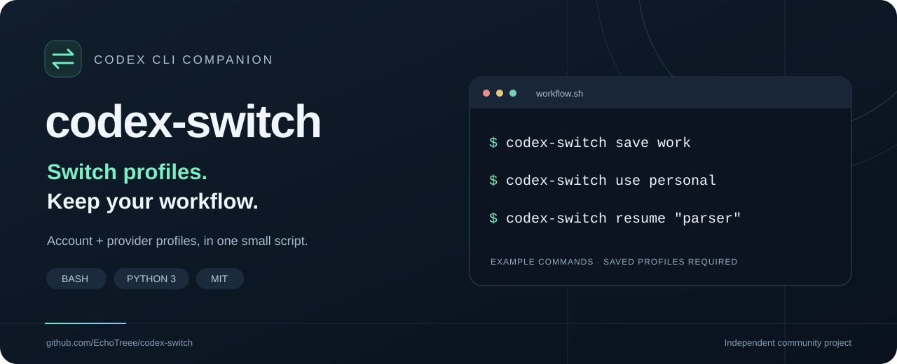

<p align="center">
  
</p>

# codex-switch

**一台机器，多账号协作；共享本地对话，配合 worktree 并行开发。**

[](LICENSE)
[](#运行要求)
[](https://github.com/EchoTreee/codex-switch/actions/workflows/checks.yml)

[English](README.md) · **简体中文**

[并行工作流](#并行工作流集中启动各自完成结束后恢复) · [官方多账号](#官方多账号使用) · [官方与中转站混用](#官方与中转站混合使用) · [安装](#安装) · [命令速查](#命令速查) · [参与贡献](CONTRIBUTING.md)

个人账号、工作账号、自定义 provider，每次切换都要手动整理登录文件和配置？给每套环境起个名字，把本地登录文件和 `config.toml` 一起保存，需要时一起恢复。

**换官方账号，或在官方与中转站之间换线路，都可以接着同一个本地对话继续工作。** 前提是使用同一 `CODEX_HOME`：历史本来就是本地同一份，无需额外同步。下面分别介绍[官方多账号](#官方多账号使用)和[官方与中转站混用](#官方与中转站混合使用)。

```bash
codex-switch save work       # 保存当前登录态和配置
codex-switch use personal    # 切换到已经保存的个人配置
codex-switch resume "parser" # 按标题关键词继续本地会话
```

## 六个核心优势

1. **一台机器，多账号并行。** 多个终端分别启动 Codex CLI，选择不同 ChatGPT 账号处理任务。作者已在实践中使用这一方式；共享 home 仍有认证竞态，请按[并行工作流](#并行工作流集中启动各自完成结束后恢复)操作。
2. **账号间共享本地对话。** 同一 `CODEX_HOME` 下，跨账号、跨兼容 provider（官方 ↔ 中转站）继续同一条对话，无需复制或同步两套历史。
3. **文件切换，不主动退出登录。** 恢复 `auth.json` + `config.toml`，减少重复登录操作。切换器不调用 `codex logout`，也不调用 token 吊销接口；但这不阻止凭据到期或被其他进程轮换。
4. **官方账号与自定义 provider 统一管理。** 已配置可用的 API-key 中转站及其 `base_url` 可一起存成 profile。环境变量形式的 key 需另行管理。
5. **配合 Git worktree 并行开发。** 每个 agent 使用独立分支和工作目录，避免直接覆盖彼此的代码文件；认证文件和外部服务仍需单独考虑。
6. **单文件脚本，轻量即用。** 只需 Bash、Python 3 标准库及常见 Unix 工具，无额外 Python 包、构建步骤或常驻服务，安装到 `~/.local/bin` 即可使用。

## 先选你的使用场景

| 对比点 | 官方多账号使用 | 官方与中转站混合使用 |
| --- | --- | --- |
| 切换的是什么？ | 登录身份，配置也可以不同。 | 登录方式、provider 线路，可能还有模型。 |
| provider 是否变化？ | 通常都为 `openai`。 | 例如 `openai` ↔ `zipwuu`。 |
| 历史是否共享？ | 同一 `CODEX_HOME` 下共享。 | 同样需要使用同一 `CODEX_HOME`。 |
| 怎么继续会话？ | 切换 profile 后，用原生 `codex resume` 恢复 `openai` 会话；也可用本工具。 | 用 `codex-switch sessions` 查找，再用 `codex-switch resume` 带入当前线路和模型。 |
| 为什么方式不同？ | 只换账号，不会因此跨越 provider。 | 找到会话与决定用哪条线路恢复，是两个不同步骤。 |

一个 Bash 脚本，搭配 Python 标准库。不需要构建，也不需要常驻服务或注册本项目的账号。

> **使用边界：**常规切换和凭据恢复应在其他共享 home 的进程退出后进行。下面的共享目录并行方式来自作者实践，仍有已知竞态；需要分开认证文件时，使用[独立 home 和 profile 存储目录](docs/usage.md#parallel-use)。

## 并行工作流：集中启动，各自完成，结束后恢复

**作者验证过的使用经验是：集中启动计划中的账号，各自完成任务，结束后再处理凭据恢复；共享 home 下频繁、无缝地来回切换仍不可靠。**

1. **提前准备。** 在没有其他进程写入共享 home 时保存有效 profile，并为各 agent 准备独立分支与 worktree。
2. **依次开好终端。** 在各自 worktree 中，先 `codex-switch use <账号>`，紧接着启动 `codex`，完成当前终端的启动后再开下一个。这能减少启动时用错账号的机会，但不能消除刷新竞态。
3. **运行中各自完成任务。** 避免手动 `use`、`save`、`relogin` 或修改共享认证文件。即使你不操作，Codex 自身仍可能刷新并写回凭据。
4. **查记录与续会话分开。** `codex-switch sessions` 只读索引，可以用来查找历史；`codex-switch resume` 会启动新 Codex 进程，仍然需要正确的登录身份，不能当成与 token 无关的操作。
5. **所有共享 home 的进程退出后再恢复。** 不要假设 profile 中一定是最新有效 token。凭据陈旧或身份不确定时，用 `codex-switch relogin <账号>` 重新登录，再启动或续聊；不能只按运行时长判断是否失效。

仍需注意三个风险：新进程可能读到另一个账号；token 轮换和并发写入可能让快照陈旧或串号；`use` 又可能按过时的 `current` 标记，把错误快照回存到 profile。

完整的双终端 worktree 示例、三个风险的原因与收尾步骤，见[并行工作流与风险指南](docs/parallel.zh-CN.md)。本地历史还在与登录态可用，是两件不同的事；也应避免多个进程同时恢复并写入同一条对话。

## 推荐搭配：herdr

想把多个并行 agent 放进一个终端界面统一查看？推荐试试 [herdr](https://github.com/herdrdev/herdr)：一个管理编程 agent 终端的 TUI，方便查看各窗格的任务状态，找到需要你处理的任务。

| 工具 | 在这套工作流中的分工 |
| --- | --- |
| **herdr** | 管理 agent 的窗格、标签页，集中查看运行中的任务。 |
| **codex-switch** | 选择保存的账号与 provider 配置，接续本地对话。 |
| **Git worktree** | 给每个 agent 独立的代码目录与分支。 |

每个 worktree 开一个窗格，再在窗格内按上面的顺序依次启动账号，就能把这套工作流集中在一个界面里。herdr 是可选搭配；codex-switch 不依赖它，这种组合也不会隔离共享的认证文件。

断开 herdr 客户端可以让后台服务和 agent 进程继续运行；服务重启后的会话恢复则会启动新进程，仍需选择正确身份。详细操作见[herdr 搭配说明](docs/parallel.zh-CN.md#用-herdr-集中管理终端)和 [herdr 快速入门](https://herdr.dev/docs/quick-start/)。

## 官方多账号使用

**适合两个或多个官方账号，provider 通常都为 `openai` 的场景。** 重点是切换登录身份，同时保留本地已有工作。

### 先分别保存每个账号

完成[安装](#安装)后，从一套已能正常使用的官方 Codex 配置开始，确认 `auth.json` 和 `config.toml` 都存在。切换前先退出使用同一 home 的运行中会话。

```bash
# 当前已登录并配置好官方账号 A。
codex-switch save official-work

# 登录官方账号 B，随后立即保存。
codex login
codex-switch save official-personal
```

登录时选对账号。外部登录后立即保存，避免下一次切换时把新账号文件写回原先记录为活跃状态的 profile。

### 日常切换与续聊

```bash
codex-switch use official-work
codex resume                  # 选择已有的官方线路会话

# 退出正在运行的会话后，再切换账号。
codex-switch use official-personal
codex resume                  # 选择同一条会话继续
```

要精确恢复，可把会话 ID 填入 `codex resume "your-session-id"`。也可以用 `codex-switch sessions` 查找，再用 `codex-switch resume "parser"` 按标题恢复，并显式采用当前 profile 的模型设置。

### 为什么通常直接 resume 就够了？

变化的是登录身份，两个账号的 `model_provider` 通常仍为 `openai`。因此，对于原本就是 `openai` 的会话，换官方账号并不要求更换 provider。本地历史也仍在同一个 home 中，不会因为账号不同而另建一套。

如果这条会话之前已经通过中转站恢复过，保存的 provider 可能已不同，应使用下面的[混合使用方式](#官方与中转站混合使用)。不同官方账号的模型权限也可能不同，需要时选择可用模型；原生选择器的工作目录过滤仍可能影响可见性。

上面的示例是顺序切换。共享 home 的多终端实践见[并行工作流](#并行工作流集中启动各自完成结束后恢复)；要分开认证文件，则使用[独立 home 与 profile 存储目录](docs/usage.md#parallel-use)，但它们不会自动共享会话历史。

## 官方与中转站混合使用

**适合账号之外，provider 线路也会变化的场景。** 同一个 Codex home 里，历史本来就是本地同一份；查找时绕过 provider 过滤，恢复时通过 `-c` 明确采用当前线路和模型。

### 先保存两套能正常工作的配置

```bash
# 当前是已验证可用的官方登录和配置。
codex-switch save official

# 在 Codex 中配置并验证中转站，随后立即保存。
codex-switch save relay
```

第二次 `save` 之前，需要实际完成中转站的 provider 标识、接口地址、模型和认证配置，并验证能正常使用。给 profile 起名 `relay` 不会自动配置中转站。环境变量形式的 API key 也不会随文件快照切换，需要另外设置，详见[provider 配置说明（英文）](docs/usage.md#custom-providers)。

### 底层是一份历史，无需同步

两套配置使用同一 `CODEX_HOME`（默认 `~/.codex`）时，对话数据保存在相同位置：

- `~/.codex/sessions/`：rollout JSONL 原始对话记录。
- `~/.codex/state_5.sqlite`：本脚本读取的会话索引。

存储目录不会按官方账号和中转站分成两套。会话可以带有 provider 元信息，但记录仍在同一个目录中；切换 profile 不会搬走或删除这些历史。

### 看起来不共享，可能只是被过滤

在作者提供的使用场景中，Codex 自带 `/resume` 按 `model_provider` 过滤：官方 `openai` 下看到官方线路会话，中转站 `zipwuu` 下看到中转线路会话；不覆盖配置时，恢复也沿用会话保存的 provider。因此换线路后某条对话“消失”，可能只是列表没有显示，而不是数据丢失。选择器行为依版本而异，工作目录过滤也可能影响可见性。

### 同一个对话，双向切换线路继续

先在同一 Codex home 下保存并验证两套 profile。下面的 `relay` 和 `official` 是已保存的 profile 名字；关键词需唯一匹配一个 CLI 会话。

```bash
codex-switch sessions           # 列出 CLI / exec 会话，不按 provider 过滤
codex-switch use relay          # 切换到保存好的中转站配置
codex-switch resume "parser"    # 自动用当前 provider/model 继续

# 退出上面的 Codex 会话，再切回官方。
codex-switch use official
codex-switch resume "parser"    # 接着同一个本地对话继续
```

等价的手动命令如下。替换会话 ID，并使用对应线路实际支持的模型；`zipwuu` 是已配置 provider 的示例标识，不是内置配置或推荐服务。

```bash
SESSION_ID="your-session-id"

# 走中转站
codex resume "$SESSION_ID" -c 'model_provider="zipwuu"' -c 'model="gpt-5.6-terra"'

# 退出会话后，走官方
codex resume "$SESSION_ID" -c 'model_provider="openai"' -c 'model="gpt-6-astra"'
```

根据作者提供的使用经验，成功跨 provider 恢复后，Codex 会将选定的 provider 写回本地索引，让这条会话“重新指向”当前线路；下次再用覆盖参数指回另一条线路，就能继续同一份本地历史。**写回由 Codex 完成，`codex-switch` 只读索引并转交覆盖参数。** 这一持久化行为尚未跨 Codex 版本独立验证，详见[原理说明（英文）](docs/usage.md#shared-history-and-provider-writeback)。

适用前提是同一 Codex home、兼容的会话格式，以及能恢复该对话的 provider/model。本地历史保留不等于每次请求都会把全部历史 token 原样放进模型上下文；独立目录或不同机器也不会自动共享记录。

**记住：找会话用 `codex-switch sessions`，续会话用 `codex-switch resume`。**

## 运行要求

- Bash、Python 3 和常见 Unix 命令行工具。
- 已安装并配置 [OpenAI Codex CLI](https://github.com/openai/codex)。
- 下方安装方式需要 Git。
- 第一次 `save` 前，Codex home 内需要同时存在 `auth.json` 和 `config.toml`。

主要面向 Linux。Windows 请在 WSL 等 Linux 环境中使用，下方命令需在 Bash 中运行。仓库包含面向 Linux/macOS 的基础测试工作流，但模拟测试通过不代表真实 Codex 登录与恢复流程已验证。当前终端输出为中文。

会话功能依赖 Codex 的 `state_5.sqlite` 和 `threads` 表结构；上游格式变化后可能需要适配。

## 安装

```bash
git clone https://github.com/EchoTreee/codex-switch.git
cd codex-switch
bash install.sh
export PATH="$HOME/.local/bin:$PATH"
codex-switch help
```

默认安装到 `~/.local/bin`，不需要 `sudo`。如果该目录尚未加入 `PATH`，可将上面的 `export` 行加入你的 shell 启动文件。

<details>
<summary>自定义安装位置、更新与卸载</summary>

```bash
# 安装到已加入 PATH 的目录
bash install.sh /your/bin/directory

# 在仓库目录中更新
git pull --ff-only
bash install.sh

# 卸载默认位置的命令
rm "$HOME/.local/bin/codex-switch"
```

卸载命令不会删除 Codex 数据或已保存的 profile。安装脚本依赖同目录下的主脚本，需要先克隆仓库，不能直接通过 URL 管道执行 `install.sh`。

</details>

## 快速开始

先准备好已有的 Codex 登录和配置，关闭使用同一 Codex home 的运行中会话。

```bash
# 保存你正在使用的账号与配置
codex-switch save work

# 登录第二个账号，随后立即保存
codex login
codex-switch save personal

# 选择已保存的环境，再启动 Codex
codex-switch use work
codex
```

在外部执行 `codex login` 或手动修改 provider 后，先 `save <名字>` 再 `use`。原因是切换时会将当前文件写回记录为活跃状态的 profile，直接切走可能覆盖原来的账号快照。登录时选对账号，并为不同环境使用不同名字。

```bash
codex-switch list             # 查看已保存的 profile，* 表示记录的活跃项
codex-switch status           # 查看本地路径、账号 ID 和 provider
codex-switch sessions         # 列出本地 CLI / exec 会话
codex-switch resume "parser"  # 关键词需要唯一匹配一个 CLI 会话
```

设备码重新登录的正确顺序是：

```bash
codex-switch relogin --device-auth work
```

## 命令速查

以下命令均需加上 `codex-switch` 前缀。

| 命令 | 行为 |
| --- | --- |
| `save <名字>` | 保存当前登录态和配置；同名 profile 会被覆盖。 |
| `use <名字>` | 刷新原活跃 profile、备份当前文件，再恢复目标 profile。 |
| `relogin <名字>` | 调用 Codex 登录并保存；已有的该 profile 配置会被恢复。 |
| `relogin --device-auth <名字>` | 通过设备码重新登录；参数在名字前。 |
| `list` | 列出 profile 和记录的活跃项。 |
| `status` | 查看本地文件路径和账号/provider 元信息。 |
| `sessions` | 从预期的 SQLite 表结构读取本地会话。 |
| `resume <关键词>` | 用当前 provider/model 参数恢复唯一匹配的 CLI 会话。 |
| `delete <名字>` | 删除已保存的 profile，不删除当前 Codex 登录文件。 |
| `help` | 查看内置帮助。 |

当前版本尚未校验 profile 名字，请使用 `work`、`personal`、`relay-dev` 等简单名称，不要传入路径或不可信输入。

## 数据保存在什么地方

| 位置 | 内容 |
| --- | --- |
| `~/.codex/` | Codex 当前登录态、配置及本地会话。 |
| `~/.config/codex-switch/profiles/<名字>/` | 该 profile 的 `auth.json` 和 `config.toml`。 |
| `~/.config/codex-switch/previous.*` | 最近一次切换前的快照，后续切换会覆盖。 |

可用 `CODEX_HOME` 指定 Codex 数据位置，用 `CODEX_SWITCH_DIR` 指定 profile 存储位置。切换只复制登录和配置文件，本地 `sessions/` 与数据库保持原位；独立 Codex home 之间不会自动同步会话。

**profile 和备份中包含未加密凭据。** 请保存在只有自己可访问的位置，不要上传到仓库。环境变量中的 API key 和系统钥匙串中的凭据不会被这些文件快照保存。切换器没有新增遥测或云同步；调用 Codex 的命令仍遵循 Codex 自身行为。详见[安全说明](SECURITY.md)。

## 常见问题

**提示缺少 `config.toml`？** 先完成 Codex 配置，确认 `CODEX_HOME` 指向你实际使用的目录；如果登录凭据只保存在系统钥匙串里，也不满足本工具的文件模式要求。

**登录态失效？** 使用 `codex-switch relogin <名字>` 重新登录。切换用 `use`，不需要额外执行 `codex logout`。

**中转站/API provider？** 先按服务方要求配置 Codex 并验证可用，再保存 profile。环境变量形式的 key 需要你自行设置，工具不会替你切换。

**能同时运行不同账号吗？** 作者采用的是集中启动各账号、各自完成任务的[共享 home 并行方式](docs/parallel.zh-CN.md)，需要接受认证刷新和回存竞态。要分开认证文件，则使用不同的 `CODEX_HOME` 和 `CODEX_SWITCH_DIR`，但历史不会自动共享；独立 worktree 只隔离代码目录。

更多细节见[使用指南（英文）](docs/usage.md)。

## 参与贡献

欢迎提交可复现的问题、平台兼容性反馈、示例和翻译。查看[贡献指南](CONTRIBUTING.md)、[路线图](ROADMAP.md)，或[新建 Issue](https://github.com/EchoTreee/codex-switch/issues/new/choose)。

如果它帮你节省了时间，欢迎点一个 Star，让更多人发现；分享实际使用场景同样很有帮助。

## 许可证

[MIT](LICENSE) © 2026 EchoTreee。本项目由社区独立开发，与 OpenAI 无隶属或背书关系。
